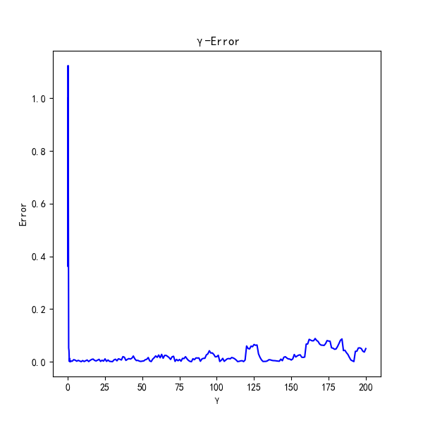
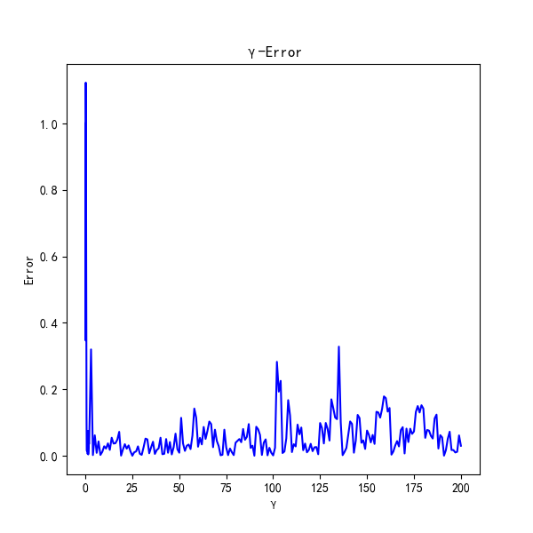
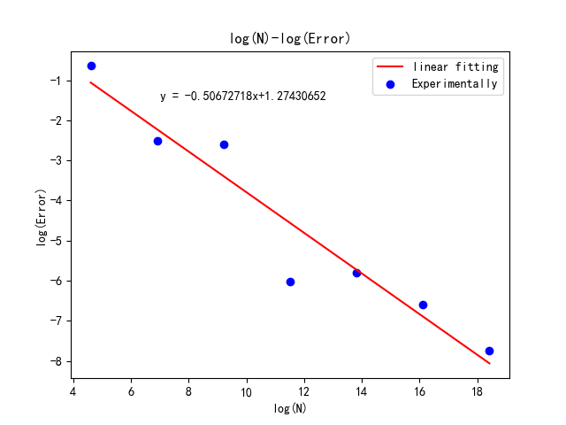
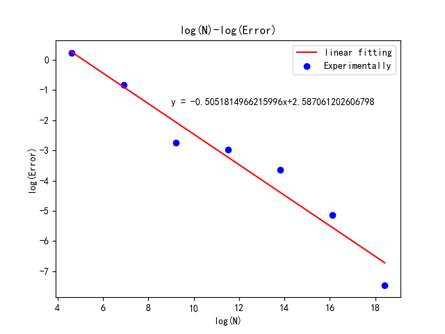
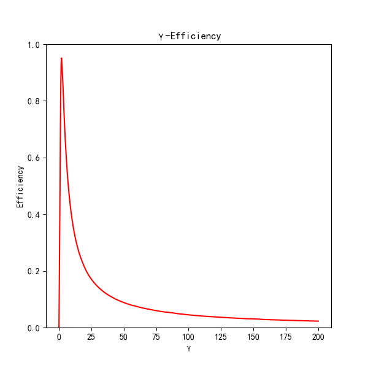
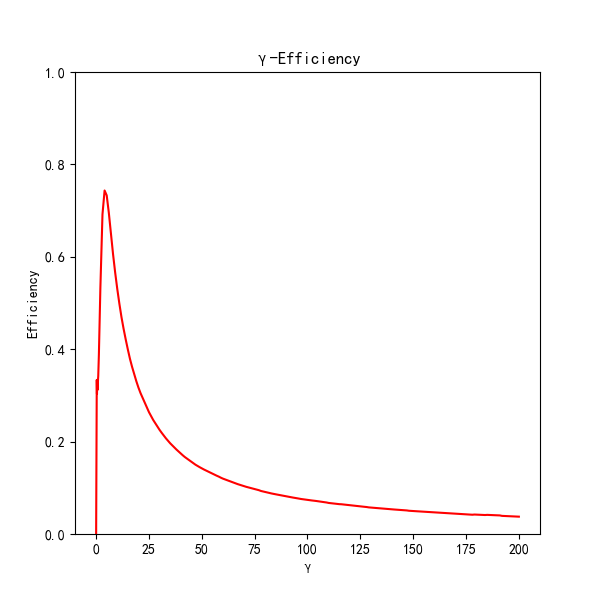
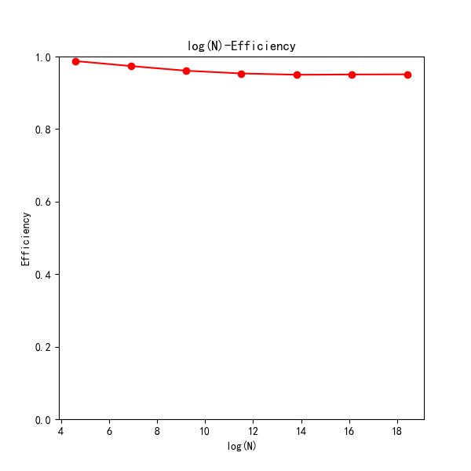
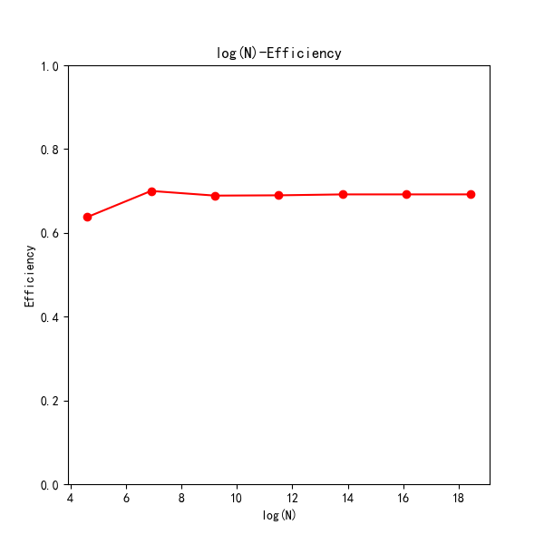
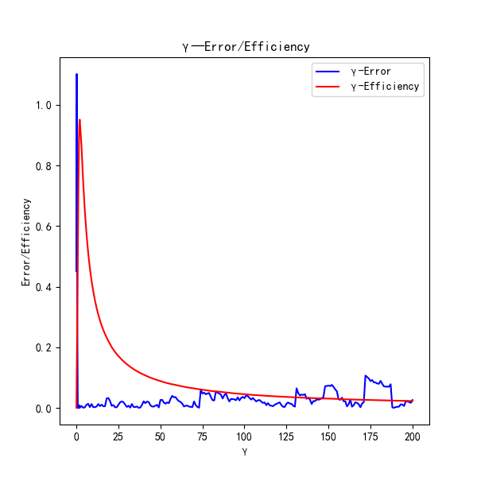
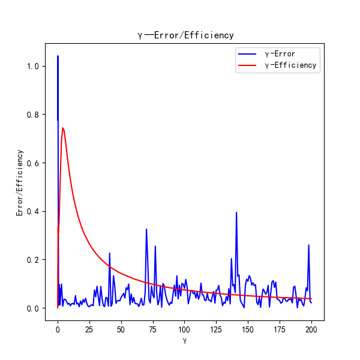

# 计算物理第十三次实验报告

​															**曾郅琛 PB20071431**

[TOC]

**摘要**：本次实验尝试使用Metropolis-Hasting抽样方法计算积分，并在不同的权重函数下讨论计算精度与结果。其中代码部分主要在*C++*和*Python*中完成。

## 实验要求

​		**用Metropolis-Hasting抽样方法计算积分：**
$$
I=\int_{0}^{\infty}(x-\alpha\beta)^2f(x)dx=\alpha\beta^2
	\\
$$

$$
and \ \ \ f(x)=\frac{1}{\beta\Gamma(\alpha)}{\left( \frac{x}{\beta}\right)}^{\alpha-1}exp(\frac{-x}{\beta})
$$
​		**设积分的权重函数为：$p(x)=f(x)$，$p(x)={(x-\alpha\beta)}^2f(x)$，给定参数$\alpha,\beta$，并用不同的$\gamma$值，分别计算积分，讨论计算精度和效率。**

## 算法与理论分析

### 不同权重函数平稳分布p(x)下的统计量求积分

#### 权重函数$p(x) = f(x)$

​	对于$p(x) = f(x)$，我们可以知道：
$$
\int_{0}^{\infty}p(x)dx=\int_{0}^{\infty}\frac{1}{\beta\Gamma(\alpha)}{\left( \frac{x}{\beta}\right)}^{\alpha-1}exp(\frac{-x}{\beta})dx=1
$$
​	根据上课讲到的Metropolis-Hasting方法，设$T$与初态无关且非对称：
$$
T_{ij}=T(x\rightarrow x')=T(x')=0.5 \,exp(-x'/\gamma)\\
$$
​	利用直接抽样法，初始设为$x_0=1$
$$
x'=-\gamma lnR_0
$$
​	其中$R$ 为[0,1]上均匀分布的随机数，由此抽取分布在$(0,\infty)$的$x'$.
$$
\frac{p_{j}T_{ji}}{p_iT_{ij}}\equiv r=\left( \frac{x'}{x_i}\right) ^{\alpha-1}exp[-(x'-x_i)/\beta]exp[(x'-x_i)/\gamma]
$$
​	$r$的大小来决定接受概率，从而得到下一步的$x_{i+1}$，其中$R_1$为另一用来舍选的随机数：
$$
x_{i+1}=
\begin{cases}
	x'& {R_1<min(1,r)}\\
	x_i&{R_1>min(1,r)}
\end{cases}
$$
​	故，此种情况下蒙特卡罗统计量为：
$$
I=\frac{1}{N_{sam}}\sum_{i=1}^{N_{sam}}(x_i-\alpha\beta)^2
$$
​	$N_{sam}$的含义在于，我们在进行Metropolis-Hasting抽样方法计算积分时，开始的抽样需要进行预热处理，去除前面热化阶段引入的参数，确保Markov链达到平稳分布，所以我们只统计在去热化之后的抽样计数。

#### 权重函数$p(x)={(x-\alpha\beta)}^2f(x)$

​	对于$p(x) = f(x)$，我们可以知道，该权重函数即为我们需要计算的被积函数：
$$
\int_{0}^{\infty}p(x)dx=\int_{0}^{\infty}(x-\alpha\beta)^2\frac{1}{\beta\Gamma(\alpha)}{\left( \frac{x}{\beta}\right)}^{\alpha-1}exp(\frac{-x}{\beta})dx=\alpha\beta^2
$$
​	于是，我们发现在这一权重函数下，自身并没有归一化处理，我们不能直接对它作为抽样函数抽样，在此我提出了一个归一化计算方法：

- 既然如此，我们可以考虑直接利用积分结果进行隐式的归一化处理：

$$
p'(x)=\frac{p(x)}{\int_{0}^{\infty}p(x)dx}
$$

- 按照$p'(x)$对随机数进行抽样抽取过程如`2.1.1`中描述；

- 在此种方法下，蒙特卡洛统计量是对$(x_i-\alpha\beta)^{-2}$进行统计平均，得到的值与最终积分值相关，证明如下：

$$
\frac{1}{N_{sam}}\sum_{i=1}^{N_{sam}}\frac{1}{(x_i-\alpha\beta)^2}\to\int_{0}^{\infty}\frac{p'(x)}{(x-\alpha\beta)^2}dx
=\int_{0}^{\infty}\frac{p(x)}{\int_{0}^{\infty}p(x)dx}\frac{1}{(x-\alpha\beta)^2}dx\\
$$

​		而我们选取的$p(x)={(x-\alpha\beta)}^2f(x)$，代入上式得到：
$$
\frac{1}{N_{sam}}\sum_{i=1}^{N_{sam}}\frac{1}{(x_i-\alpha\beta)^2}\to
\frac{1}{\int_{0}^{\infty}p(x)dx}\int_{0}^{\infty}f(x)dx=\frac{1}{\int_{0}^{\infty}p(x)dx}=\frac{1}{I}
$$
​		这样我们需要计算的积分可以通过抽样计算得到：
$$
I≈\frac{1}{\frac{1}{N_{sam}}\sum_{i=1}^{N_{sam}}\frac{1}{(x_i-\alpha\beta)^2}}
$$

- 值得注意的是，我们在抽样时需要注意到$(x_i-\alpha\beta)^2$作为分母不能为$0$，所以我在程序代码中也对这一小概率事件进行了约束。但事实上（~~讲道理~~）有两点可以忽略这一问题：

  1. 由于$x_i\in(0,\infty)$，而$\alpha\beta$为实数域上一个点，其测度为0，在我们选取抽样点仍为有限值时，这一问题几乎可以忽略；
  2. 在计算机中无论是`float`还是`double`类型，都存在精度的舍入误差，所以我们并不担心$(x_i-\alpha\beta)^2$的取值恰为0，这又是另一个原因了。

  但为了严谨起见，我们还是防止这一现象的产生做好了充足准备；

### 算法描述

- `double function1(double a,double b, double alpha, double beta, double gamma)`
  - 描述$p(x)=f(x)$时，$p_{j}T_{ji}/p_iT_{ij}$的计算函数式子；
- `double function2(double a,double b, double alpha, double beta, double gamma)`
  - 描述$p(x)={(x-\alpha\beta)}^2f(x)$时，$p_{j}T_{ji}/p_iT_{ij}$的计算函数式子；

- `void Metropolis_Hasting_Sampling_1(double alpha, double beta, double gamma, int N)`
  - 对于第一种权重函数的Metropolis_Hasting_Sampling过程

- `void Metropolis_Hasting_Sampling_2(double alpha, double beta, double gamma, int N)`
  - 对于第二种权重函数的Metropolis_Hasting_Sampling过程

- 探讨gamma与精度、效率关系中，gamma取值从0~2每0.1取一个点， 2~200每1取一个点；
- 探讨抽样点N与精度、效率关系中，N从$10^2$到$10^8$每一个数量级取一个点；

## 误差分析

### 积分误差随$\gamma$的变化分析($N=10^6$)

​	误差函数：
$$
Error= \left| I(\gamma) -\alpha\beta^2\right|
$$
​	在实验过程中，我们始终选取$\alpha=2,\beta=1$，而在探讨积分误差时，采样点个数选为$N=10^6$：

#### 权重函数$p(x) = f(x)$

​	对于第一个权重函数，我们运行`void Metropolis_Hasting_Sampling_1(double alpha, double beta, double gamma, int N)`函数，并将结果存在txt文件中，*python*绘图如下。

			<!--块级封装-->
    
	<!--将图片和文字居中-->
    
     		<!--换行-->
    图1：γ——误差关系图(第一种权重函数情况)	<!--标题-->
    

#### 权重函数$p(x)={(x-\alpha\beta)}^2f(x)$

​	对于第二个权重函数，我们运行`void Metropolis_Hasting_Sampling_2(double alpha, double beta, double gamma, int N)`函数，并将结果存在txt文件中，*python*绘图如下：

			<!--块级封装-->
    
	<!--将图片和文字居中-->
    
     		<!--换行-->
    图2：γ——误差关系图(第二种权重函数情况)	<!--标题-->
    

#### 定性分析

由图1，图2分析在不同权重函数下$γ$——误差的共性与不同点：

- 共性：

  当$\alpha=2,\beta=1,N=10^6$时，$\gamma$在开始取很小值（0~1）范围内，计算积分的误差很大；从1到5左右误差迅速减小到趋于0，在5到75之间误差在0附近涨落，当$\gamma$值很大时之后，误差在振荡幅度越来越大。

  - 具体定性分析如下：

  1. $\gamma$的取值与每次试探更新的步长正相关，故而在一条“光滑曲线”中通过寻找最低点必然与步长有关；
  2. 当$\gamma$太小时步长过小，导致系统容易局限在局域最低点而达不到整个曲线的*global*最小值，即很难达到*Markov chain*的整体平稳分布，产生较大误差；
  3. 当$\gamma$太大时步长过大，Metropolis抽样系统一方面容易越过但不进入整个曲线的*global*最小值，造成较大误差；另一方面，在后面的分析效率过程中`3.2`可以看出，此时效率也就是接受率很小， 即系统大概率留在原来的非平稳位置，所以造成很难到达*Markov chain*的整体平稳分布，产生较大误差；

- 不同点：

  1. 对于第一种权重函数，可以直观看到，与第二种相比整体误差更小；

  2. 第一种权重函数误差的涨落更趋向于稳定；

     原因分析如下：

     1. 当权重函数取第一种时，其自身已经是归一化好的函数，自身函数性质也更稳定；
     2. 第二种权重函数的归一化过程为人为构造的过程，里面并没有包含数学运算而是一些假定的推导，同时我们在计算时取了两次倒数，导致在此过程中产生了较大的舍入误差，在经过$10^6$步累计后，计算机的精度误差不断放大，导致原始误差会产生更大的涨落项，因而效果不如第一种权重函数。

### 积分误差随$N$的变化分析($\gamma=3.0$)

​	误差函数如(14)式所描述：

​	在实验过程中，我们始终选取$\alpha=2,\beta=1$，而在探讨积分误差时，$\gamma=3.0$：

​	同时我们在处理误差与N关系曲线时，选取对数曲线来验证$Error\propto O(N^{-1/2})$关系，进而通过中心极限定理和大数定理证明权重抽样过程的合理性，在程序中利用*python*线性拟合数据点，并将拟合直线打印在图片中：

#### 权重函数$p(x) = f(x)$

			<!--块级封装-->
    
	<!--将图片和文字居中-->
    
     		<!--换行-->
    图3：N——误差关系图(第一种权重函数情况)	<!--标题-->
    

#### 权重函数$p(x)={(x-\alpha\beta)}^2f(x)$

			<!--块级封装-->
    
	<!--将图片和文字居中-->
    
     		<!--换行-->
    图4：N——误差关系图(第二种权重函数情况)	<!--标题-->
    

#### 定性分析

​	如上所说，选取对数曲线来验证$Error\propto O(N^{-1/2})$关系，进而通过中心极限定理和大数定理证明权重抽样过程的合理性。由图3，4可得，在两种权重函数下，误差与N的关系都能很好的接近中心极限定理：

| 理论 | 第一种权重函数 | 第一种权重函数 |
| ---- | -------------- | -------------- |
| -0.5 | -0.50673       | -0.50518       |

​	与理论表达式都吻合较好
$$
Error\propto O(N^{-1/2})
$$

## 效率分析

### 积分效率随$\gamma$的变化分析($N=10^6$)

​	积分效率定义为接受抽样得到新的Markov链点与总抽样点之比：
$$
\eta= N_{accept}/N_{total}
$$
​	在实验过程中，我们始终选取$\alpha=2,\beta=1$，而在探讨积分效率时，采样点个数选为$N=10^6$：

#### 权重函数$p(x) = f(x)$

			<!--块级封装-->
    
	<!--将图片和文字居中-->
    
     		<!--换行-->
    图5：γ——效率关系图(第一种权重函数情况)	<!--标题-->
    

#### 权重函数$p(x)={(x-\alpha\beta)}^2f(x)$

			<!--块级封装-->
    
	<!--将图片和文字居中-->
    
     		<!--换行-->
    图6：γ——效率关系图(第二种权重函数情况)	<!--标题-->
    

#### 定性分析

​	由图5，图6分析在不同权重函数下$γ$——效率的共性与不同点：

- 共性：

  当$\alpha=2,\beta=1,N=10^6$时，$γ$——效率曲线呈现尖峰的形状，$\gamma$在开始取值在0~3范围内，积分的效率随着$\gamma$增大而增大；当$\gamma>3$左右时之后，积分效率迅速减小到接近于0；

  具体定性分析如下：

  1. $\gamma$的取值与每次试探更新的步长正相关，故而在一条“光滑曲线”中通过寻找最低点必然与步长有关；
  2. 当$\gamma$太小时步长过小，导致系统容易局限在局域最低点而达不到整个曲线的*global*最小值，即很难达到*Markov chain*的整体平稳分布，所以在不断抽样过程中很难继续向者整体最低点前进，对抽样效率产生较大影响；
  3. 当$\gamma$太大时步长过大，Metropolis抽样系统一方面容易越过但不进入整个曲线的*global*最小值， 出现跳跃或者不动的状态，故而此时效率很小。

- 不同点：

  1. 与第二种相比，对于第一种权重函数整体效率更高，最高值达到了95%；

  2. 第二种权重函数误差的整体效率更低，最高值不到80%；

     原因分析如下：

     1. 当权重函数取第一种时，为已知函数分布，在抽样过程中更接近分布；
     2. 第二种权重函数就是所求积分自身被积函数，与已知函数分布相比分布不太稳定，因而效果不如第一种权重函数。

### 积分效率随$N$的变化分析($\gamma=3.0$)

​	在实验过程中，我们始终选取$\alpha=2,\beta=1$，而在探讨积分效率时，采样点个数选为$\gamma=3.0$：

#### 权重函数$p(x) = f(x)$

			<!--块级封装-->
    
	<!--将图片和文字居中-->
    
     		<!--换行-->
    图7：N——效率关系图(第一种权重函数情况)	<!--标题-->
    

#### 权重函数$p(x)={(x-\alpha\beta)}^2f(x)$

			<!--块级封装-->
    
	<!--将图片和文字居中-->
    
     		<!--换行-->
    图8：N——效率关系图(第二种权重函数情况)	<!--标题-->
    

#### 定性分析

​	随着N的增大抽样效率越发趋向于某个特定数，这正是中心极限定理的作用，在N很大时更接近理论情况。

​	另外，我们可以看到，第一种权重函数抽样效率明显好于第二种权重函数：

- 第一种情况最终稳定在95.1%附近；
- 第二种情况最终稳定在69.2%附近；

## 在不同$\gamma$取值下对于两种权重函数对Error/Efficiency影响

### 第一种权重函数

			<!--块级封装-->
    
	<!--将图片和文字居中-->
    
     		<!--换行-->
    图9：γ——误差/效率关系图(第一种权重函数情况)	<!--标题-->
    

​	由此看出，我们应该选用1~10左右范围内的$γ$，从而保证效率较高的情况下，误差尽可能较小；

### 第二种权重函数

			<!--块级封装-->
    
	<!--将图片和文字居中-->
    
     		<!--换行-->
    图9：γ——误差/效率关系图(第二种权重函数情况)	<!--标题-->
    

​	由此看出，我们应该选用3~10左右范围内的$γ$，从而保证效率较高的情况下，误差尽可能较小；

​	具体选取应该更精细地讨论，在此由于时间原因不做详细展开。

## 总结

​	通过本次实验学会了Metropolis重要抽样以及解决在未归一化情况下权重函数的处理，实验进行较为顺利。

