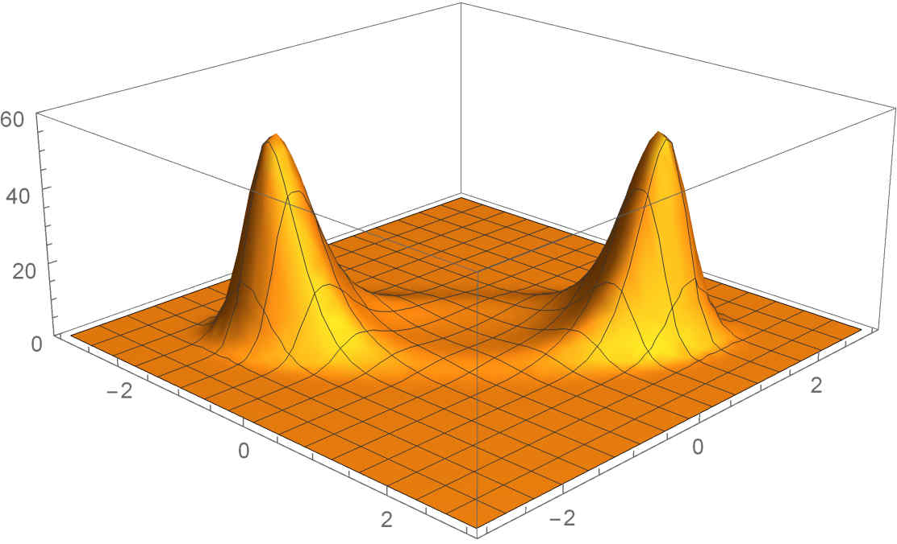

# 计算物理第十五次实验报告

​															**曾郅琛 PB20071431**

[TOC]

**摘要**：本次实验尝试使用*Metropolis-Hasting*抽样方法计算在指定分布下体系的力学量均值，并在不同的温度(**$\beta=\frac{1}{kT}$**)下讨论计算精度与结果。其中代码部分主要在*C++*和*Python*中完成。

## 实验要求

​		**设体系的能量为：**
$$
H(x,y)=-2(x^2+y^2)+\frac{1}{2}(x^4+y^4)+\frac{1}{2}(x-y)^4
$$

​		**采用*Metropolis*抽样法计算:**
$$
<x^2>,<y^2>,<x^2+y^2>
$$
​		**分别取$\beta=0.2, 1.0,5.0.$抽样时在2维平面上依次标出*Markov*链点分布，从而形象地理解*Markov*链.**

## 算法与理论分析

### 理论分析

​	由玻尔兹曼分布，对于如上的Hamilton量，体系的分布概率函数为：
$$
F(x,y)=\frac{exp(-\beta H(x,y))}{Z}
\\
$$
​	其中Z为配分函数：
$$
Z=\int_{-\infty}^\infty  \int_{-\infty}^\infty \,-\beta(-2(x^2+y^2)+\frac{1}{2}(x^4+y^4)+\frac{1}{2}(x-y)^4)dxdy
$$
​	以上设定的$\beta$值即是温度的代名词，$\beta=\frac{1}{kT}.$

​	待求值表示为：
$$
<x^2>=\frac{\int\int x^2e^{-\beta H}}{Z}
\\
<y^2>=\frac{\int\int y^2e^{-\beta H}}{Z}
\\
<x^2+y^2>=<x^2>+<y^2>=\frac{\int\int( x^2+y^2)e^{-\beta H}}{Z}
$$

### *Metropolis* 抽样

​	我们假定初始点为$(x_0,y_0)$，则下一步试探点$(x_t,y_t)$：
$$
x_t=(\xi_1-0.5)\Delta x+x_0
\\
y_t=(\xi_2-0.5)\Delta y+y_0
$$
​	其中$\xi_1,\, \xi_2$为$[0,\,1]$均匀分布的随机数；

​	根据正则系统的$Boltzmann$分布作为平衡构型时的分布，所以从$(x_0,y_0)$过渡到$(x_t,y_t)$的概率为:
$$
p(\vec{x}\rightarrow\vec{x_t})=min\{1,r\}\
$$
​	根据上课讲到的*Metropolis*，其中：
$$
r=e^{-\beta (H_t-H_0)}
$$
​	$r$的大小来决定接受概率，从而得到下一步的$x_{i+1}$，其中$R_1$为另一用来舍选的随机数：


$$
(x_{i+1},y_{i+1})=
\begin{cases}
	(x_t,y_t)& {R_1<min(1,r)}\\
	(x_0,y_0)&{R_1>min(1,r)}
\end{cases}
$$
​	经过多次重复后，序列$\{x_i,y_i\}$即为我们所需的满足分布的马尔科夫链

​	故，此种情况下蒙特卡罗统计量为：
$$
Result=\frac{1}{N_{sam}}\sum_{i=1}^{N_{sam}}sample
$$
​	$N_{sam}$的含义在于，我们在进行*Metropolis*抽样方法计算积分时，开始的抽样需要进行预热处理，去除前面热化阶段引入的参数，确保*Markov*链达到平稳分布，所以我们只统计在去热化之后的抽样计数。

​	在本次实验中选取$N_{total}=10^7$，选取$\frac{1}{2}N_{total}=5×10^6$之后的点作为生成的马尔科夫链。

### 初始点的选择

​	首先，我们对*Boltzmann*分布进行探寻极值问题，因为我们知道马克科夫链容易陷入局域一个极值点后，就在局域极值点内打转，此时需要用退火法跳出，但这里我们不想考虑如此复杂的问题，对于显式的*Boltzmann*分布我们有办法找到其有限的所有极值点：
$$
\frac{ \partial F(x,y) }{ \partial x }=-\beta F(x,y)(-4x+2x^3+2(x-y)^3)=0
\\
\frac{ \partial F(x,y) }{ \partial y }=-\beta F(x,y)(-4y+2y^3-2(x-y)^3)=0
$$
​	利用*Mathematica*解出两个极值点：$(-\sqrt2, -\sqrt2),\,(\sqrt2, \sqrt2)$，$3D$图如下：

<div>			<!--块级封装-->
    <center>	<!--将图片和文字居中-->
    
    <br>		<!--换行-->
    图1：Boltzmann分布(β=1.0)	<!--标题-->
    </center>
</div>

​	故而，我们在选取初始点时，需要注意玻尔兹曼分布有两个极值点。在开始我选取了$(1,1)$点作为初始点，计算得到结果与理论吻合很好，虽然这样操作每次都会落入最近的$(\sqrt2, \sqrt2)$区域范围内，但仔细一想由于玻尔兹曼函数具有高度对称性对于$x,y$坐标，所以这并不影响我们最终结果。当然为了安全和保险起见，我们在代码中也选取了其他靠近$(-\sqrt2, -\sqrt2)$这一极值点的初始点。

## 算法描述

- `double Hamilton_F(double x,double y)`
  - 描述哈密顿函数；
- `double function1(double x,double y, double xt, double yt, double beta)`
  - 描述*Metropolis*细致平衡条件计算函数式子；
- `double Metropolis_Hasting_Sampling(double *x, double *y,double delta,double beta,int N,const char*p)`
  - *Metropolis_Sampling*过程；
- `void Print_results(double beta,char*p)`
  - 打印计算输出和存入文件；
- 探讨$\beta$与精度、效率关系；

## 实验结果分析

### 利用*Mathematica*计算理论值


### 不同步长对实验结果的影响

​	在实验中我们选取$N=10^7$，作为总的试探点数：

#### *when step=0.1*

```html
step=0.1
When β=0.2, 用时: 6.58272s, 效率: 0.983012
<x^2>:1.60996
<y^2>:1.54993
<x^2+y^2>:3.15989
    
When β=1, 用时: 6.15234s, 效率: 0.960605
<x^2>:1.66613
<y^2>:1.67215
<x^2+y^2>:3.33828
    
When β=5, 用时: 6.83823s, 效率: 0.904631
<x^2>:1.9493
<y^2>:1.94814
<x^2+y^2>:3.89744
```

$\beta=0.2： < 𝑥^2 > = 1.56189， < 𝑦^2 >= 1.56189，< 𝑥^2+y^2 > = 3.12377  $。 误差范围控制在5%以内，效率为98%，积分值和理论值十分接近。  下图为此时对于Markov链点：


$\beta=1.0： < 𝑥^2 > = 1.68247  ， < 𝑦^2 >= 1.68247 ，< 𝑥^2+y^2 > = 3.36494    $。 误差范围控制在2%以内，效率为96%，积分值和理论值十分接近。  下图为此时对于Markov链点：


$\beta=5.0： < 𝑥^2 > =1.94783    ， < 𝑦^2 >= 1.94783    ，< 𝑥^2+y^2 > =3.89566  $。 误差范围控制在0.1%以内，效率为90%，积分值和理论值十分接近。  下图为此时对于Markov链点：


#### *when step=0.5*

​	同样的和前面过程相同只是改了步长，再次不再一一赘述：

```html
step=0.5
When β=0.2, 用时: 4.54242s, 效率: 0.915386
<x^2>:1.56032
<y^2>:1.55908
<x^2+y^2>:3.1194
    
When β=1, 用时: 4.43904s, 效率: 0.805555
<x^2>:1.68166
<y^2>:1.68341
<x^2+y^2>:3.36507
    
When β=5, 用时: 4.36524s, 效率: 0.559691
<x^2>:1.94799
<y^2>:1.94707
<x^2+y^2>:3.89506
```

​	以下三张图分别对应$\beta=0.2,1.0,5.0$:

$\beta=0.2： < 𝑥^2 > = 1.56189， < 𝑦^2 >= 1.56189，< 𝑥^2+y^2 > = 3.12377  $。 误差范围控制在2%以内，效率为91%，积分值和理论值十分接近。  下图为此时对于Markov链点：


$\beta=1.0： < 𝑥^2 > = 1.68247  ， < 𝑦^2 >= 1.68247 ，< 𝑥^2+y^2 > = 3.36494    $。 误差范围控制在2%以内，效率为80%，积分值和理论值十分接近。  下图为此时对于Markov链点：


$\beta=5.0： < 𝑥^2 > =1.94783    ， < 𝑦^2 >= 1.94783    ，< 𝑥^2+y^2 > =3.89566  $。 误差范围控制在0.1%以内，效率为56%，积分值和理论值十分接近。  下图为此时对于Markov链点：


#### *when step=2.0*

​	同样的继续增大步长可以得到以下结果和马尔科夫链：

```html
step=2
When β=0.2, 用时: 7.65156s, 效率: 0.679138
<x^2>:1.56049
<y^2>:1.55788
<x^2+y^2>:3.11837

When β=1, 用时: 8.57977s, 效率: 0.369835
<x^2>:1.68259
<y^2>:1.68256
<x^2+y^2>:3.36515

When β=5, 用时: 8.1617s, 效率: 0.0817308
<x^2>:1.94693
<y^2>:1.94657
<x^2+y^2>:3.8935
```

​	可以看到此时的效率已经很低了，说明此时我们的初始点距离极值点和步长量级相比有些过小，会出现反复横移的现象，所以效率低，但最终计算结果任然很好！由于篇幅原因不做具体说明：


​	由三种不同大小步长的对比我们可以看出：

-  *step = 2.0* 生成的点链基本上是按照玻尔兹曼分布的等势线分布的， 即说明在模拟过程中点链逐渐由初始位置向势能较低的位置的过渡，而且我们惊讶的发现$\beta$取值为0.2和1时，点列形成了两个极值点平衡位置，虽然我们选取的初始位置离其中一个更近，但马尔可夫平衡仍在两个平衡点上都取到；
-  *step = 0.1* 对应的点链， 我们发现点链的生成顺序并不是按照等势线生成的，而是呈现出一种杂乱无序的方式生长。 同时在点链生成的初期已经有很大一部分点链就已经达到了势能最小值（也就是极值点的位置）， 但这之后却有大量的点会跃迁到其他势能较高的位置，这一点从效率出奇的高也可以看出。说明此时虽然马尔科夫链看起来已经平衡，但点会逃离这个平衡，这与实际不太吻合，说明这时步长选取不太合理。
-  *step = 0.5* 的情况下，处于两种中间情况，点链可以到达平衡但需要花费一段时间，最终会落到某一个势阱中；
-  每次试探步长过小时，将导致势阱对点链的束缚变弱很多，导致两步之间的势能差异非常小，点链更容易向非平衡位置移动。 这样，就会出现杂乱的现象。
- 当步长过短时，马尔科夫链不易覆盖被积区域，过长时则由于来回波动很大，容易逃离概率密度高的地方而造成效率低。
- 最终我们分析得到，步长的选择应该正比于玻尔兹曼分布的半宽高$\frac{1}{\sqrt \beta}$.这样得到的效果属于两者都可以均衡的情况。

### 选取不同的初始位置探讨点链陷入的平衡位置

​	接下来我们本应该探讨初始点位于第三象限的点，但由于玻尔兹曼函数的对称性我们这部分也就省去了，和第一象限情况理论上应该大差不差。

​	于是，我们想探讨一下在初始点距离两个极值点相同距离的情况下，点链会朝着什么方向运动，也即我们选取$(0,\,0)$作为初始点，由图一我们可以再看一下玻尔兹曼分布：

<div>			<!--块级封装-->
    <center>	<!--将图片和文字居中-->
    
    <br>		<!--换行-->
    图1：Boltzmann分布(β=1.0)	<!--标题-->
    </center>
</div>

​	以下选取步长为0.5进行实验：

#### *when β=0.2*


​	可以看到此时的马尔科夫链平衡有两个区团，对应刚好为玻尔兹曼极值点位置，做出三维图以加对比：


#### *when β=1.0*


​	$\beta=1.0$时，点链最终运动到第三象限的极值点位置：


#### *when β=5.0*


​	而对于更大的$\beta$而言，会更快地到达平衡从而在某一更容易到达的极值点位置出到达马尔可夫平衡。

由以上可以看出：

- $\beta=1/kT$，对应于温度的高低，当温度较高时马克科夫链会更趋向于一种不平衡的状态我们也就能看到点链会在两个极值点位置来回运动，体系的涨落将会变得比较大；

- 随着实验温度降低， 系统更多被冻结在基态，呈现出快速收敛到分布的极值点也就是平衡位置的现象，使得积分收敛于一个稳定值。  

  

## 总结

​	在本次实验中， 我们对于给定的哈密顿量，进行了 Metropolis 重要抽样方法模拟， 并探讨了模拟准确度、效率和模拟参数$\beta$(即温度)的关系。同时我们探讨了存在两个极值点位置的情况，对于不同的步长和温度进行了细致分析，最终实验得到完成！
